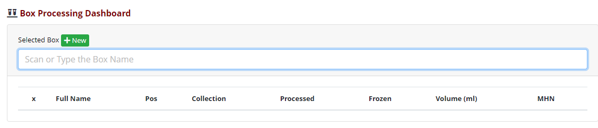
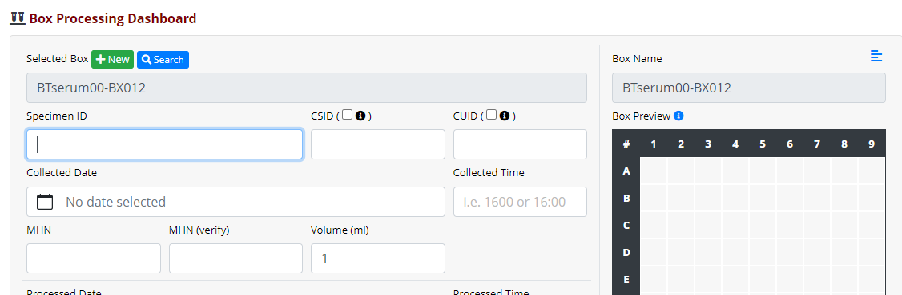
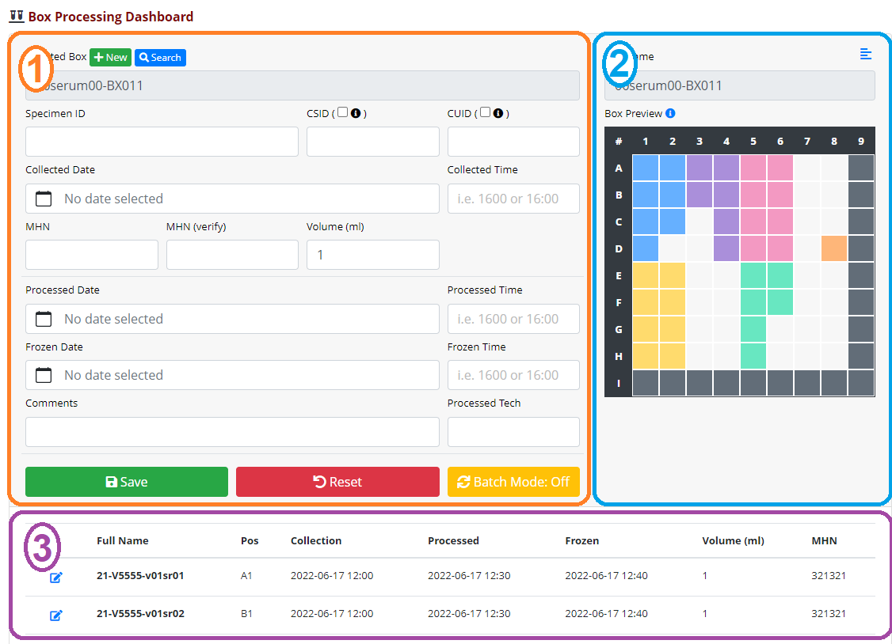

# Biospecimen Tracking (REDCap External Module)

An easy-to-use custom interface for receiving, boxing, and shipping specimens.

---

> **NOTE:** This is an **early access (beta)** build.
> 
> Some aspects of this module may be incomplete or subject to change prior to official release to the EM Repo. 
> 
> Additionally, this documentation is a work in progress while development continues.  Some information may be incomplete, missing, or outdated.
>
> Stay Tuned!!!

## Features

- Control Center-level configuration to support a variety of project setups
    - Multiple project configurations can be created
- Comprehensive box & specimen validation
- A specimen receipt interface that includes:
    - Streamlined data entry
    - Detailed list of specimens
    - Box preview for quick at-a-glance look at specimens in the current box.
- Shipment assignment interface
- Shipment manifest exports

---

## Technical Requirements

- REDCap
    - Framework Version: 8
    - Minimum: v11.1.1 STD
    - Latest: 12.4.3
- PHP
    - Tested against: v7.4.21 and v8.0.24

---

## Permissions

- redcap_every_page_top
   - Used to seamlessly redirect the user back to the custom pages of this module, after creating a new box.

---

## Developer Notes

This project makes use of VueJS and Laravel Mix to develop and build.

To build, use `npx mix watch`.  See the [laravel docs](https://laravel-mix.com/docs/6.0/cli) for more details.

## Getting Started

- This module works as intended through careful setup of 3 projects (box, specimen, & shipment), with additional required configuration in the Control Center.
- Each of the 3 projects have a handful of requirements.

### Box Project Requirements

- General Project Setup
    - Non-longitudinal
    - Non-repeating instrument that contains all required fields.
    - Other fields/instruments can exist, so long as they don't interfere with the previous 2 points.
        - Consider long-term performance when expanding the project - **less is more**!
- Required Fields
    - `[record_id]`
        - The projects record ID field must remain the default value of `[record_id]`.
            - **TODO** this could be updated without too much issue, to not care what its called.
    - `[box_name]`
        - Expected Field Type: **Text**
        - This is the primary field for identifying boxes.
        - Must be unique.
            - Consider utilizing the Secondary Unique Field feature for this.
    - `[box_type]`
        - Expected Field Type: **Single Select (dropdown/radio)**
        - A key field for determining the type of box being used.
        - Validation, box orientation, and other features depend on this value.
        - Special Values (reserved)
            - 00, Mixed 00 Temporary Storage
                - Can only be used in a very specific project type due to a significant amount of logic & validation surrounding this box type.
            - **TODO** Shipping|Archive|Destroyed
    - `[sample_type]`
        - Expected Field Type: **Single Select (dropdown/radio)**
        - Specimen and volume validation, and volume unit display depend on this value.
    - `[shipment_record_id]`
        - Reference field for the shipment this box is assigned to.
        - This is never interacted with directly, and should only ever be modified through standard module usage.

### Aliquot Project Requirements

- General Project Setup
    - Non-longitudinal
    - Non-repeating instrument that contains all required fields.
    - Other fields/instruments can exist, so long as they don't interfere with the previous 2 points.
        - Consider long-term performance when expanding the project - less is more!
- Required Fields
    - `[record_id]`
        - The projects record ID field must remain the default value of `record_id`.
    - `[name]`
        - This is the primary field for identifying aliquots.
        - Must be unique.
            - Consider utilizing the Secondary Unique Field feature for this.
    - `[box_record_id]`
        - This is where we store the reference to the box where this aliquot currently resides.
        - This is never interacted with directly, and should only ever be modified through standard module usage.
        
### Shipment Project Requirements

- General Project Setup
    - Non-longitudinal
    - Non-repeating instrument that contains all required fields.
    - **Any optional fields will display and be part of any shipment interface or manifest**
- Required Fields
    - `[record_id]`
        - The projects record ID field must remain the default value of `record_id`.
    - `[shipment_date]`
        - Expected Field Type: **Text**
        - Expected Validation: **Any Date format**
        - Allows the search interface to be sorted chronologically
    - `[sample_type]`
        - Expected Field Type: **Single Select (dropdown/radio)**
        - Must match (or be a subset of) `sample_type` in the box project

### Control Center Configuration

> **NOTE:** This section can only be completed by REDCap Administrators.

After the projects are created, module configuration can begin within the Control Center.

1. Start by selecting the Box, Aliquot & Shipment Projects.
1. Specify the box dimensions that will be used in this configuration
    - Currently, this module only supports a single box size per configuration.
1. The remaining configuration options should be self-explanatory (HOPEFULLY!)

## Regular Expressions (Box and Aliquot Nomenclature)

For the BOX regular expression, the following is a list of all allowable named capture groups that are currently coded/used within validation.
- `box_type`
- `sample_type`
- `aliquot_number`
- `visit`
- `box_number`

For the ALIQUOT regular expression, the following is a list of all allowable named capture groups that are currently coded/used within validation.
- `year`
- `participant_id`
- `visit`
- `sample_type`
- `aliquot_number`

More on these regular expressions in the Validation section.

---

## Usage

The primary entry point to this module's functionality is the "Box Dashboard" link in the "External Modules" section of the sidebar.

### Creating a Box

You need a Box!?  Click that wonderfully green New button!

It will take you to the data entry page for a box, allowing you to provide all necessary data values and save it.  Be sure the `[box_name]` & `[box_type]` fields have a value as a result of this data entry step.

When the save step is complete, REDCap will try to take you back to the Record Home page for that new box.  Instead, the module will bring you right back to this dashboard, with the new box in context! 

### Scanning an existing Box

If you're coming to the dashboard with a box already in-hand, or you have a specific box you want to search for, simply type or scan the box name into the search field and hit enter.  If it exists, it the interface will update to be in context of that box; otherwise, it will display an appropriate error message.

- Some errors (alerts) will generally indicate the box does not exist.
- You may also see validation errors if what was typed/scanned does not match the box nomenclature.

### Dashboard layout (in Box context)

Before covering more detailed usage, let's review the general layout of the dashboard.

#### Specimen Entry `[1]`

This is where you set your box context, and where most of the data entry occurs.

- Designed to flow from field to field, as you scan or hit the `ENTER` key (`TAB` also works).
- Has a `Batch Mode` that further streamlines data entry.
    - Can pre-fill many fields, depending on the match level of the scanned specimen.

#### Box Preview/Details `[2]`

A summary of specimens within the box.

- Depending on `[box_type]`, specimens may be displayed in more than 1 color. 

#### Specimen List `[3]`            

A list of all specimens currently in the box.

- Shows most (but not all) data tied to a specimen
- Sorted based on `box_type`
- Has the ability to edit a specimen, if necessary
    - A dialog will pop up, containing the same interface in section `[1]`

#### Adding a Specimen to the Box

As you work through the fields, from Specimen Name all the way to Tech Initials, you will eventually come across one or more of the many validation checks that are in place.  This validates every piece of data provided, to ensure it meets all our requirements.  These validations include (but not limited to):

- The specimen name nomenclature
    - This is pulled from the Control Center configuration mentioned earlier.
- CSID/CUID syntax
    - CSID is a 10-digit number
    - CUID is 8-digit alphanumeric
- Date/Time values are in an appropriate sequence and meet certain time separation requirements
    - Processed Time must be at least 30 minutes after Collected Time
    - Frozen Time must be at least 10 minutes after Processed Time
- Basic box validation
    - It's not full
        - This concept expands beyond basic empty positions for the 'Temporary' box type.
- The box is a valid destination for the scanned specimen
    - Given all the keywords in the specimen nomenclature (i.e. year, visit, etc.), all values must be equal for any matching keyword in the box nomenclature.
        - Example: Specimen `21-V5555-v01[sr][01]` scanned in context of Box `AA[serum][01]-BX011`
            - Lets assume that specimen nomenclature groups indicated by `[]` are `sample_type` (`sr`) and `aliquot_number` (`01`).  The box also contains a `sample_type` (`serum`) and `aliquot_number` (`01`).  Aliquot number is an exact match, and there's a built-in mapping that states `sr` is a shorthand match for `serum`.
            - Since the specimen contains no other named parts that align with the box nomenclature, this specimen passes this validation step.

### Editing a Specimen

> This section is under construction

### Validation

Validation is a major component of this module, ensuring data entry is as clean and accurate as possible.

> This section is under construction

---

## Support & Feedback

- If you identify any issues, please submit an issue on this GitHub repo or make a post on the forums and tag me (@chris.kadolph) and/or Leila Deering (@leila.deering).